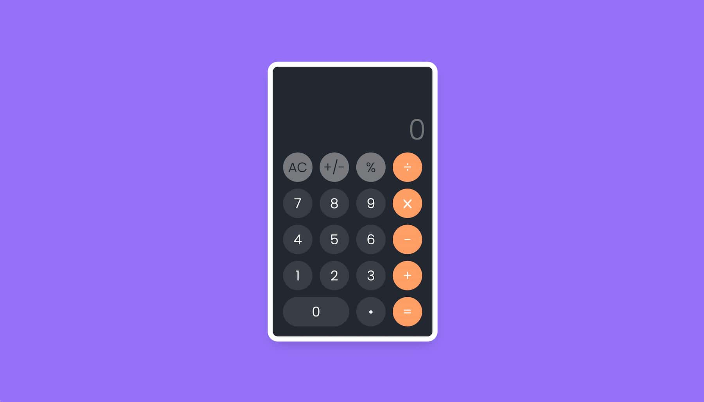

# Tic-Tac-Toe (VanillaJS)

## Description

This is a simple calculator build with VanillaJS

Demo: [https://calculadora-vanilla-js.netlify.app/](https://calculadora-vanilla-js.netlify.app/)

## Tecnologies

Language: [JavaScript]

Bundle: [Nothing](https://vitejs.dev/)

Deploy: [Netlify](https://www.netlify.com/)

## Other Projects

Tic-tac-toe: [Repository](https://github.com/achipre/tic-tac-toe--beginner), [Demo](tresenraya-reactjs.netlify.app)
